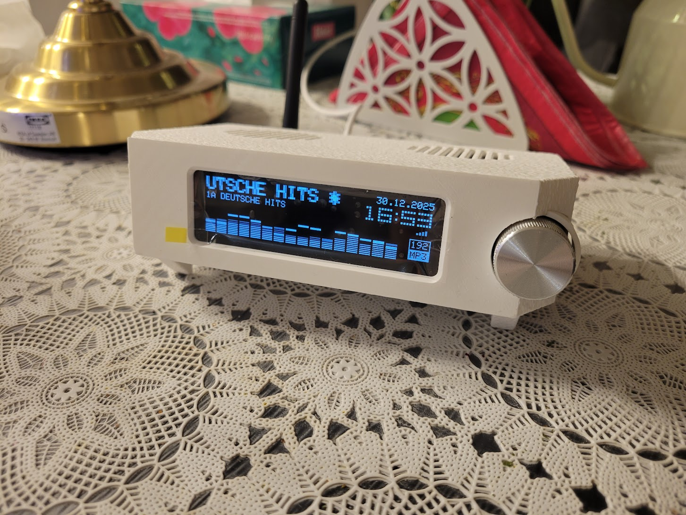
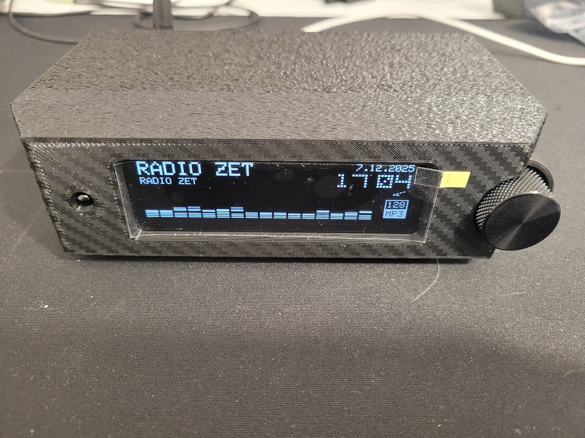
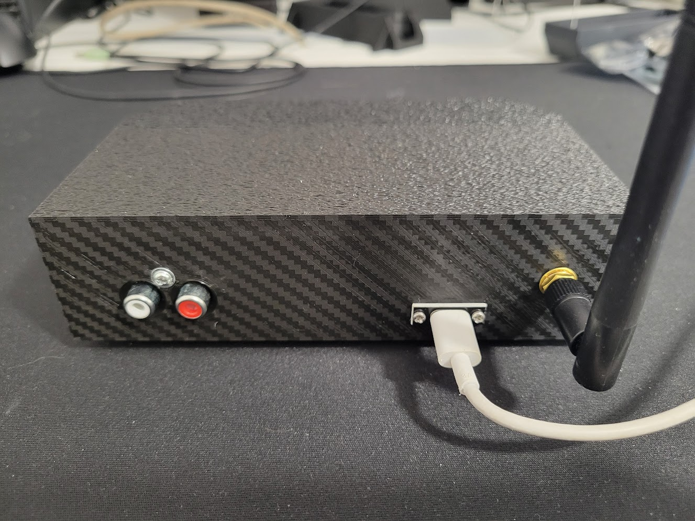
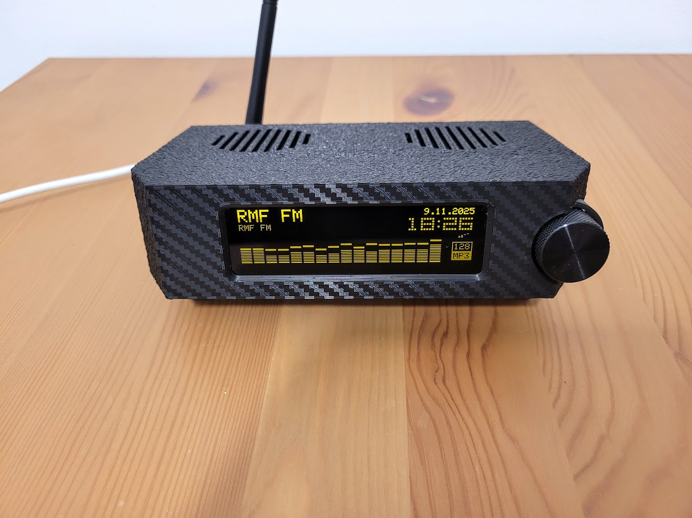
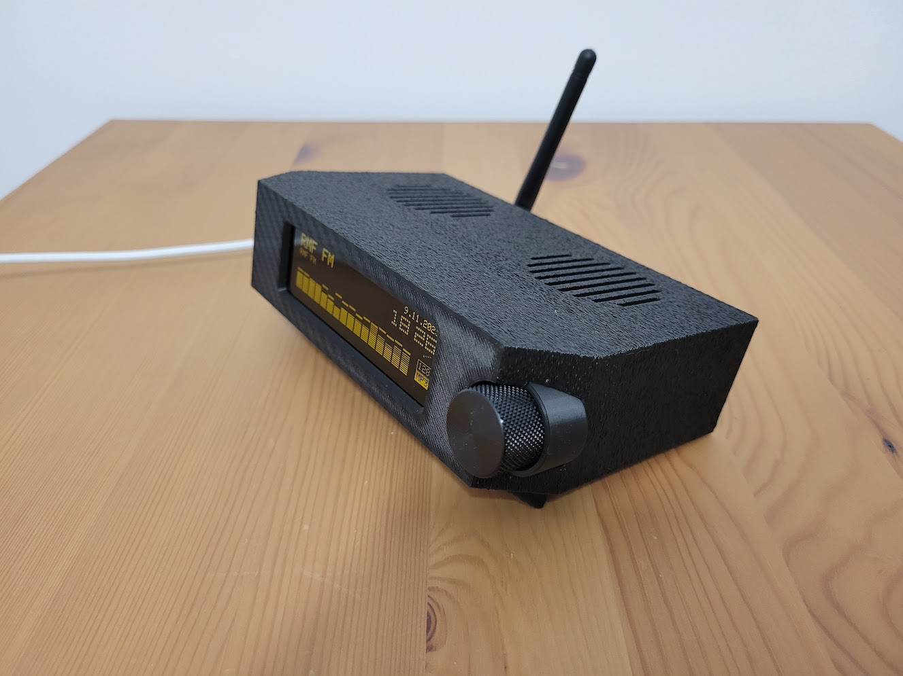
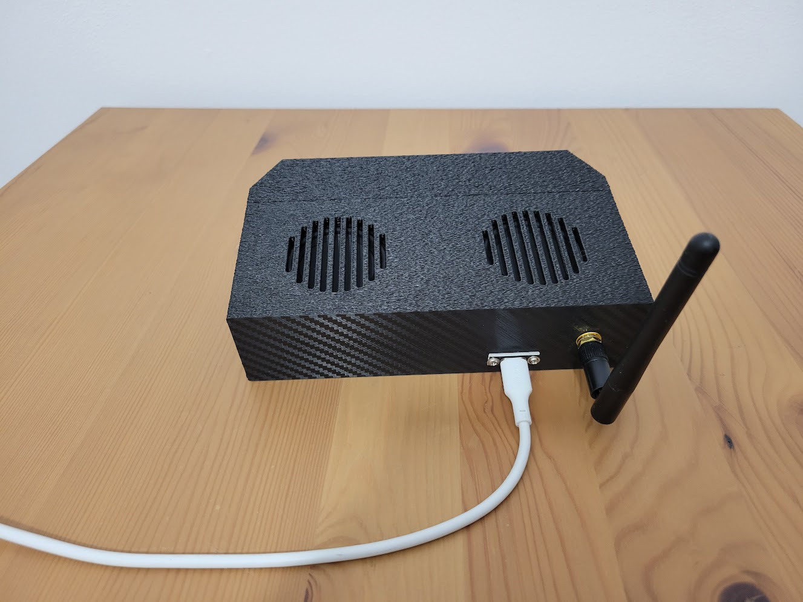
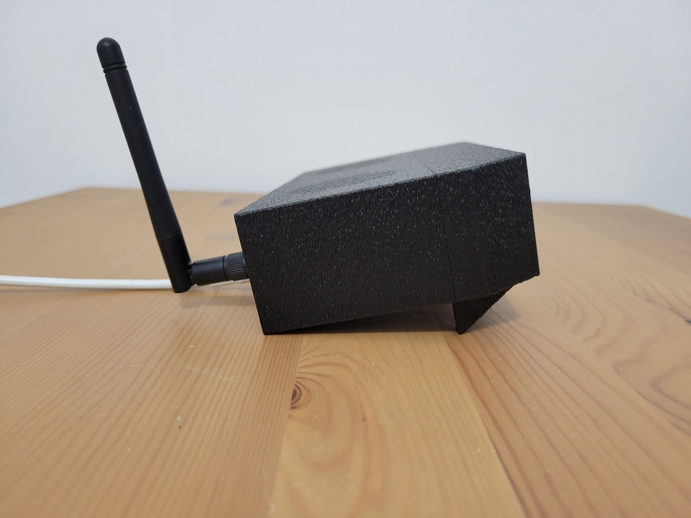

# PCB and Enclosure for the Yoradio Internet Radio

This project includes **only** the PCB and the enclosure; it does **not** include any software. MIT License.

**WARNING: This project is intended for advanced users. It is meant for further expansion and modification.**

## Versions

Two enclosure versions are provided: one as a kitchen radio with speakers, and another with an RCA output for connecting to an external amplifier.

### RCA Version

### With speakers version 

## Key components

The design was created around a few specific key parts; using other variants may require adjusting the enclosure and the PCB accordingly.

### Display

Only for SSD1322 display

### Encoder

https://pl.aliexpress.com/item/1005003534390893.html

### Knob

For the encoder above, you need the `Flower Shaped` variant.

 

https://pl.aliexpress.com/item/1005006912587864.html

### Speakers

https://pl.aliexpress.com/item/1005008571777367.html

### Less important parts

Personally, as the DAC and amplifier I used the **WeAct Studio I2S Speaker Module PCM5100A 4Ω 2.8W D Class Dual PA**.

https://pl.aliexpress.com/item/1005009660188314.html

### Acknowledgements

Special thanks to **Inżynier Programista** for help solving FreeCAD issues. Link to his YouTube channel: https://www.youtube.com/@InzynierProgramista
